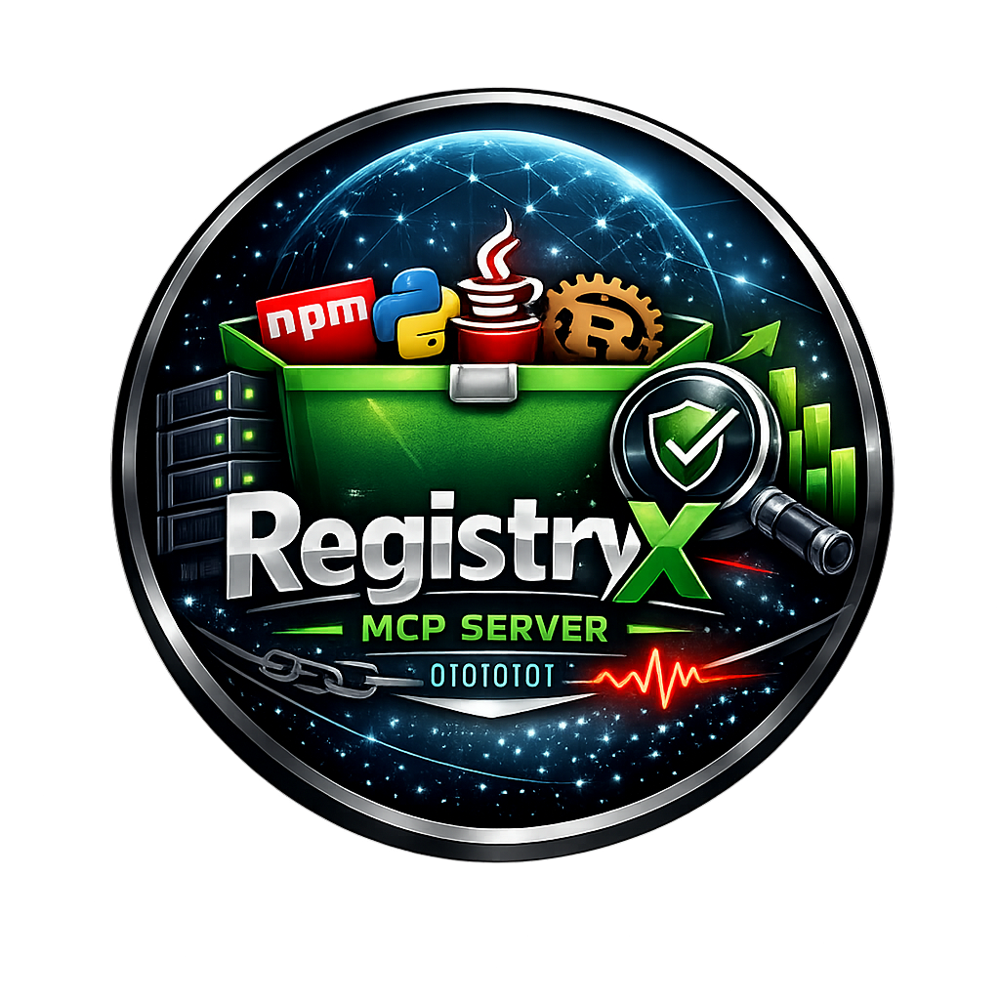

<p align="center">
  
</p>

<h1 align="center">registryx-server</h1>

<p align="center">
  <em>MCP server for unified package registry access — npm, PyPI, Maven Central, crates.io</em>
</p>

<p align="center">
  
  = 20" />
  
  
</p>

---

## Installation

```bash
npm install -g registryx-server
```

## Usage

### VS Code `mcp.json`

```json
{
  "servers": {
    "registryx": {
      "type": "stdio",
      "command": "registryx-server",
      "env": {
        "REGISTRYX_MCP_REGISTRIES": "npm,pypi,maven,crates"
      }
    }
  }
}
```

### Claude Desktop

```json
{
  "mcpServers": {
    "registryx": {
      "command": "npx",
      "args": ["registryx-server"]
    }
  }
}
```

### Cursor

```json
{
  "mcpServers": {
    "registryx": {
      "command": "node",
      "args": ["/path/to/registryx-server/dist/index.js"]
    }
  }
}
```

## Tools

### Search

#### `registryx_search`
Search packages across registries simultaneously.

| Parameter | Type | Default | Description |
|-----------|------|---------|-------------|
| `query` | `string` | — | Search text |
| `registry` | `"npm" \| "pypi" \| "maven" \| "crates" \| "all"` | `"all"` | Target registry |
| `limit` | `number` | `10` | Results per registry (max 50) |

**Example output:**
```
RegistryX Search — "json schema validator"

📦 npm (3 results):
  ajv                            8.17.1       JSON Schema Validator
  jsonschema                     1.4.1        An implementation of JSON Schema
  zod                            3.23.8       TypeScript-first schema validation

📦 pypi (1 results):
  jsonschema                     4.23.0       JSON Schema validation for Python
```

#### `registryx_search_alternatives`
Find equivalent packages in other ecosystems.

| Parameter | Type | Description |
|-----------|------|-------------|
| `packageName` | `string` | Package to find alternatives for |
| `sourceRegistry` | `"npm" \| "pypi" \| "maven" \| "crates"` | Source registry |
| `targetRegistries` | `array` | Registries to search (default: all others) |

---

### Package Details

#### `registryx_get_package`
Get package metadata, license, homepage, keywords.

| Parameter | Type | Description |
|-----------|------|-------------|
| `name` | `string` | Package name (Maven: `groupId:artifactId`) |
| `registry` | `string` | Registry name |

#### `registryx_get_readme`
Fetch README content (up to 8000 chars).

#### `registryx_get_maintainers`
List authors and maintainers.

---

### Versions

#### `registryx_list_versions`

| Parameter | Type | Default | Description |
|-----------|------|---------|-------------|
| `name` | `string` | — | Package name |
| `registry` | `string` | — | Registry |
| `limit` | `number` | `20` | Max versions |
| `stable` | `boolean` | `true` | Exclude pre-releases |

#### `registryx_get_version`
Get details for a specific version: date, license, size, dependencies.

#### `registryx_compare_versions`
Diff two versions — shows added/removed dependencies.

| Parameter | Type | Description |
|-----------|------|-------------|
| `name` | `string` | Package name |
| `registry` | `string` | Registry |
| `version1` | `string` | First version |
| `version2` | `string` | Second version |

---

### Dependencies

#### `registryx_get_dependencies`

| Parameter | Type | Default | Description |
|-----------|------|---------|-------------|
| `name` | `string` | — | Package name |
| `registry` | `string` | — | Registry |
| `version` | `string` | latest | Version (optional) |
| `type` | `"runtime" \| "dev" \| "all"` | `"runtime"` | Dependency type |

#### `registryx_reverse_dependencies`
Find packages that depend on this one. Supported on npm and crates.io.

---

### Health & Stats

#### `registryx_download_stats`

| Parameter | Type | Default | Description |
|-----------|------|---------|-------------|
| `name` | `string` | — | Package name |
| `registry` | `string` | — | Registry |
| `period` | `"last-day" \| "last-week" \| "last-month" \| "last-year"` | `"last-month"` | Time period |

#### `registryx_package_health`
Returns a health score (0–10) and signals: typings, tests, README quality, documentation links.

#### `registryx_security_advisories`
Queries [OSV.dev](https://osv.dev) for known CVEs. Supports npm, PyPI, Maven, and crates.io.

---

## Configuration

| Variable | Required | Default | Description |
|----------|----------|---------|-------------|
| `REGISTRYX_MCP_REGISTRIES` | No | `npm,pypi,maven,crates` | Enabled registries (comma-separated) |
| `REGISTRYX_MCP_NPM_TOKEN` | No | — | npm auth token (private packages) |
| `REGISTRYX_MCP_TIMEOUT_MS` | No | `15000` | Request timeout in ms (1000–120000) |
| `REGISTRYX_MCP_CACHE_TTL_MS` | No | `300000` | Cache TTL in ms (0 = disabled) |

## Security

- SSRF protection: only requests to registry.npmjs.org, api.npmjs.org, pypi.org, search.maven.org, crates.io, and osv.dev are allowed
- All connections use HTTPS
- npm token loaded from environment only — never logged
- Input validation via zod schemas on all tool parameters

## License

[MIT](../../LICENSE)
